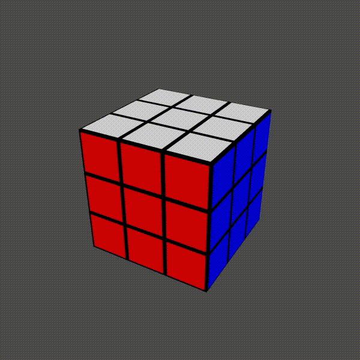

# Rubik

A 3D Rubik's Cube simulator and solver written in C++17 with OpenGL.
The solver uses Kociemba's two-phase algorithm.

## Controls

### Camera
- **Mouse Scroll**: Zoom in/out
- **W / A / S / D**: Move up / left / down / right
- **R**: Reset position

### Cube
- **ENTER**: Scramble
- **SPACE**: Solve
- **1**: Reset

### Face moves
- **UP / DOWN / LEFT / RIGHT / FRONT / BACK**: U, D, L, R, F, B (90°)
- **CTRL + key**: Prime move (-90°)

### Misc
- **Left Click**: Capture the mouse
- **TAB**: Release the mouse
- **Esc**: Quit

## Compiling

Rubik uses **C++17**, **OpenGL**, **GLFW**, and **GLAD**.

### Requirements

- C++17 compiler
- CMake
- OpenGL 4.3+
- GLFW (included as git submodule, built automatically)
- GLAD (included)